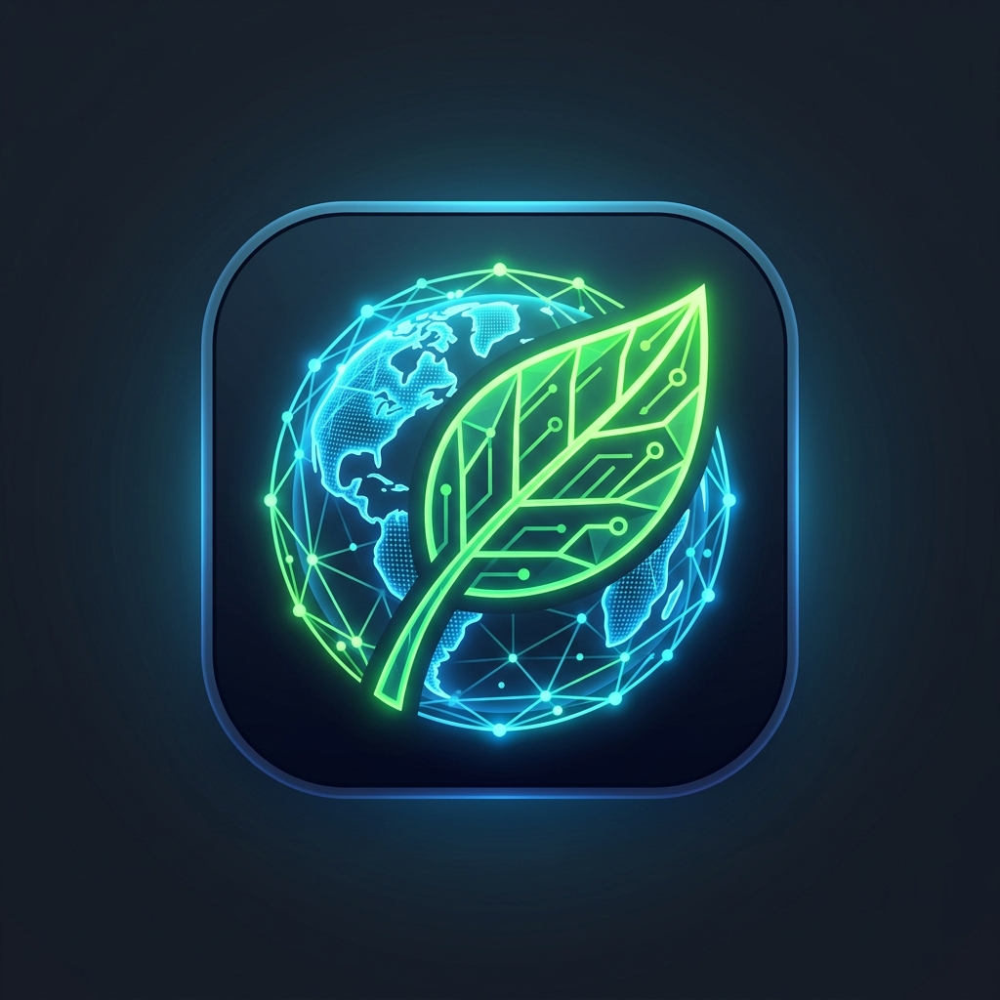
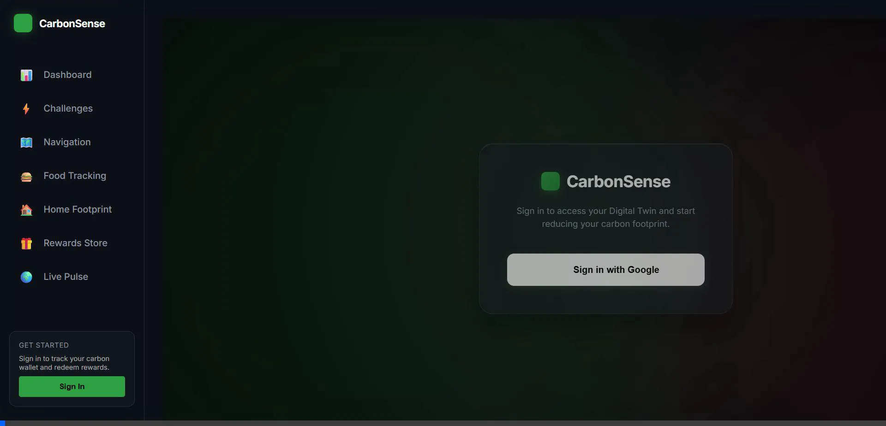
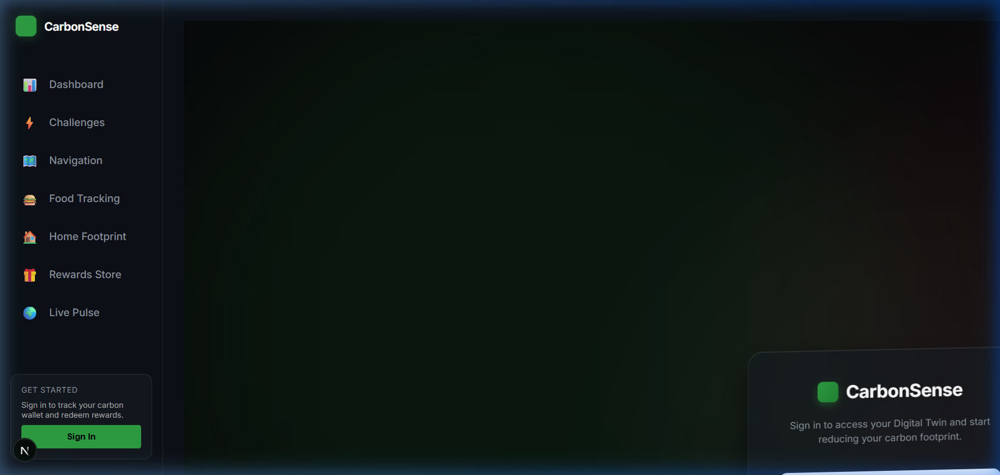
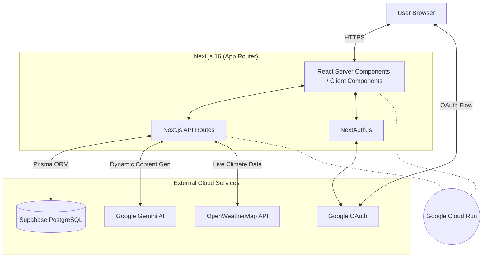

<div align="center">
  
  
  <h1>CarbonSense</h1>
  <p><strong>A Next-Generation Carbon Emission Awareness Platform</strong></p>
</div>

---

## 🌟 Overview

**CarbonSense** is a modern, AI-powered platform designed to build awareness around daily carbon emissions. It gamifies sustainability by tracking your habits—like food consumption and daily routines—and visualizes your impact through an interactive **Digital Twin Dashboard**.

Built with the cutting-edge **Next.js 16 App Router**, CarbonSense delivers a seamless, glassmorphic user experience, powered dynamically by **Google's Gemini AI**.

---

## 📸 Application Previews

### Magnetic Parallax Login Experience
Enjoy a buttery-smooth, interactive login card that tracks cursor movement with a 3D magnetic spring effect!





---

## 🏗️ System Architecture

CarbonSense follows a modern full-stack Serverless architecture:



### Tech Stack
- **Frontend**: [Next.js 16](https://nextjs.org), React 19, Vanilla CSS Modules (Glassmorphism).
- **Backend**: Next.js API Routes, Server Actions.
- **Database**: [PostgreSQL (via Supabase)](https://supabase.com) mapped using [Prisma ORM](https://www.prisma.io/).
- **Authentication**: [NextAuth.js (Auth.js)](https://next-auth.js.org/) using Google Provider (`proxy.js` edge middleware).
- **AI Integration**: [Google Generative AI](https://ai.google.dev/) (@google/generative-ai) for calculating footprint approximations from text routines.
- **Hosting**: [Google Cloud Run](https://cloud.google.com/run) via Source Buildpacks.

---

## 🚀 Getting Started for Developers

To run this project locally and contribute, follow these steps:

### 1. Prerequisites
- Node.js `v24+` installed.
- A PostgreSQL database (e.g., Supabase).
- API Keys for Google Maps, Google Gemini, OpenWeatherMap, and Google OAuth credentials.

### 2. Clone and Install
```bash
git clone https://github.com/pratyush06-aec/carbon-emission-awareness-platform.git
cd "carbon emission awareness platform"
npm install
```

### 3. Environment Variables
Create a `.env` file in the root of your project and populate the following secrets:
```env
# Database
DATABASE_URL="postgresql://<user>:<password>@<host>:<port>/<db>"

# APIs
NEXT_PUBLIC_GOOGLE_MAPS_API_KEY="your_maps_key"
GEMINI_API_KEY="your_gemini_key"
OPENWEATHERMAP_API_KEY="your_weather_key"

# Authentication
NEXTAUTH_URL="http://localhost:3000"
NEXTAUTH_SECRET="generate_a_secure_random_string"
```

### 4. Database Setup (Prisma)
Initialize the database and generate the Prisma client:
```bash
npm run postinstall
npx prisma db push
```

### 5. Run the Development Server
```bash
npm run dev
```
Open [http://localhost:3000](http://localhost:3000) to view the application in your browser.

---

## ☁️ Deployment

This project is configured for **Google Cloud Run** using source-based deployment (Buildpacks). 

To deploy:
1. Ensure the `gcloud` CLI is installed and authenticated.
2. Run the deployment command passing the required environment variables:
```bash
gcloud run deploy carbonsense \
  --source . \
  --region us-central1 \
  --allow-unauthenticated \
  --set-env-vars="DATABASE_URL=...,GEMINI_API_KEY=...,NEXTAUTH_SECRET=..."
```
3. Once deployed, update your Google OAuth Authorized Origins in the Cloud Console to include the newly generated `.run.app` domain. Update your `NEXTAUTH_URL` environment variable to match.

---

## 📄 License
This project is licensed under the MIT License.
