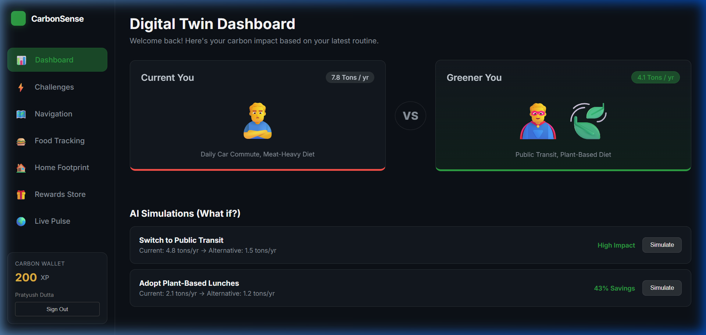
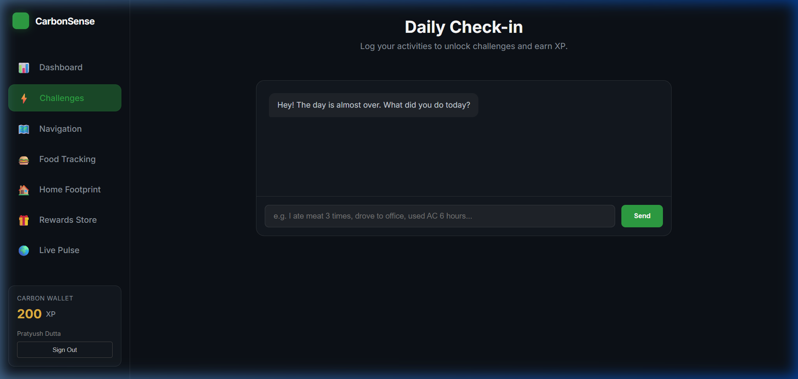
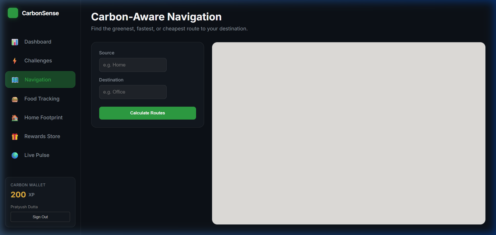
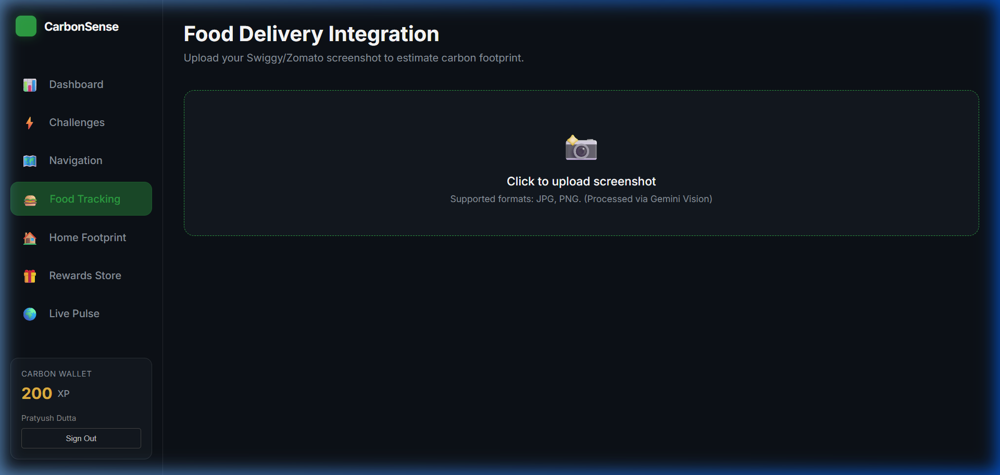
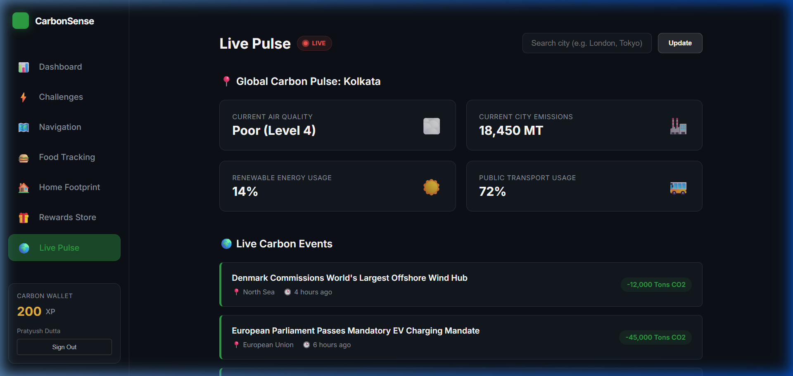
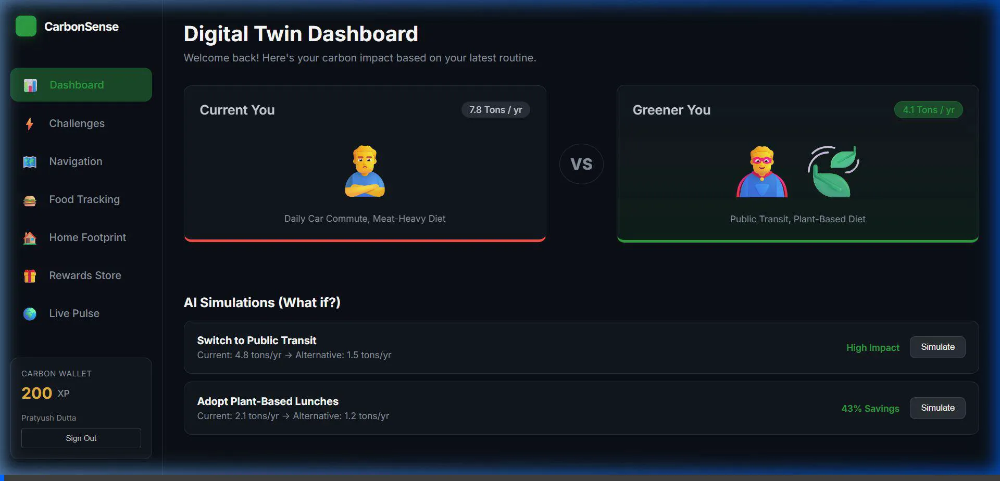
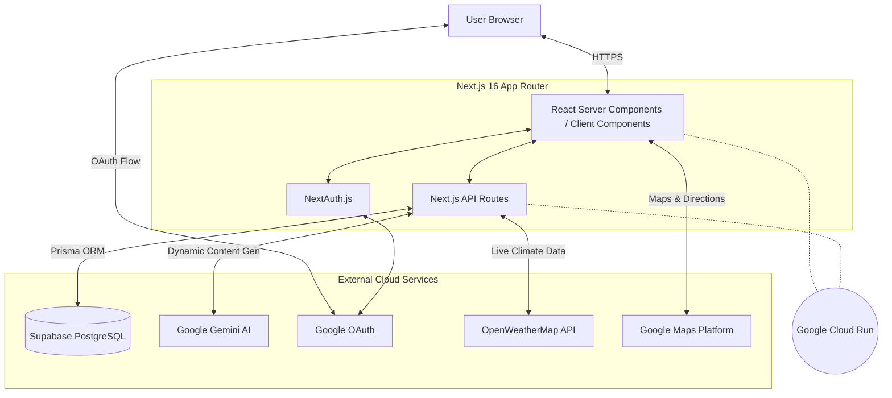

<div align="center">
  
  
  <h1>CarbonSense</h1>
  <p><strong>A Next-Generation Carbon Emission Awareness Platform</strong></p>
  <p>
    <a href="https://carbonsense-187101563807.us-central1.run.app">🌐 Live Demo</a> •
    <a href="#-features">✨ Features</a> •
    <a href="#-getting-started-for-developers">🚀 Quick Start</a> •
    <a href="#%EF%B8%8F-system-architecture">🏗️ Architecture</a>
  </p>
</div>

---

## 🌟 Overview

**CarbonSense** is a modern, AI-powered platform designed to build awareness around daily carbon emissions. It gamifies sustainability by tracking your habits—like food consumption, daily routines, and home energy usage—and visualizes your impact through an interactive **Digital Twin Dashboard**.

Built with the cutting-edge **Next.js 16 App Router**, CarbonSense delivers a seamless, glassmorphic user experience, powered dynamically by **Google's Gemini AI**.

---

## 🌐 Live Deployment

The application is deployed and accessible at:

🔗 **[https://carbonsense-187101563807.us-central1.run.app](https://carbonsense-187101563807.us-central1.run.app)**

> Hosted on **Google Cloud Run** with zero-downtime revisions and auto-scaling.

---

## ✨ Features

| Feature | Description |
|---|---|
| **📊 Dashboard** | Digital Twin dashboard with Pac-Man contribution grid, emission heatmap, and quick stats |
| **⚡ Challenges** | AI-generated daily carbon awareness quizzes based on your actual routine |
| **🗺️ Navigation** | Carbon-aware routing with Google Maps comparing car vs. public transit emissions |
| **🍔 Food Tracking** | Upload Swiggy/Zomato screenshots to estimate food delivery carbon footprint via Gemini Vision |
| **🏠 Home Footprint** | Analyze your home appliances and get per-appliance carbon ratings and actionable tips |
| **🎁 Rewards Store** | Spend earned XP on eco-friendly rewards and track your Carbon Wallet balance |
| **🌍 Live Pulse** | Real-time city-level environmental metrics with AQI data from OpenWeatherMap |

---

## 📸 Application Previews

### 🔐 Magnetic Parallax Login Experience
A buttery-smooth, interactive login card that tracks cursor movement with a 3D magnetic spring effect.


---

### 📊 Digital Twin Dashboard
Your personalized sustainability command center with contribution grids, emission heatmaps, and quick-action cards.



---

### ⚡ AI-Powered Challenges
Tell CarbonSense about your day and receive personalized carbon awareness quizzes, powered by Gemini AI.



---

### 🗺️ Carbon-Aware Navigation
Compare driving vs. public transit emissions for any route, with real-time Google Maps integration and tangible impact equivalences.



---

### 🍔 Food Delivery Carbon Tracker
Upload a food delivery receipt screenshot and let Gemini Vision break down the carbon footprint by packaging, delivery, and food type.



---

### 🌍 Live Pulse — City Environmental Dashboard
Real-time AQI data, city emission estimates, global sustainability news, and community missions.



---

### 🎬 Full App Walkthrough
A video walkthrough navigating through the key features of the application.



---

## 🏗️ System Architecture

CarbonSense follows a modern full-stack Serverless architecture:



### Tech Stack

| Layer | Technology |
|---|---|
| **Frontend** | [Next.js 16](https://nextjs.org), React 19, Vanilla CSS Modules (Glassmorphism) |
| **Backend** | Next.js API Routes, Server Actions |
| **Database** | [PostgreSQL (via Supabase)](https://supabase.com) mapped using [Prisma ORM](https://www.prisma.io/) |
| **Authentication** | [NextAuth.js (Auth.js)](https://next-auth.js.org/) using Google Provider |
| **AI Integration** | [Google Generative AI](https://ai.google.dev/) (`gemini-flash-lite-latest`) for carbon footprint calculations and challenge generation |
| **Maps** | [Google Maps Platform](https://developers.google.com/maps) for carbon-aware navigation routing |
| **Weather** | [OpenWeatherMap API](https://openweathermap.org/api) for real-time AQI data |
| **Hosting** | [Google Cloud Run](https://cloud.google.com/run) via Source Buildpacks |
| **Testing** | [Jest](https://jestjs.io/) + [React Testing Library](https://testing-library.com/docs/react-testing-library/intro/) |

---

## 🚀 Getting Started for Developers

To run this project locally and contribute, follow these steps:

### 1. Prerequisites
- Node.js `v24+` installed.
- A PostgreSQL database (e.g., [Supabase](https://supabase.com)).
- API Keys for Google Maps, Google Gemini, OpenWeatherMap, and Google OAuth credentials.

### 2. Clone and Install
```bash
git clone https://github.com/pratyush06-aec/carbon-emission-awareness-platform.git
cd "carbon emission awareness platform"
npm install
```

### 3. Environment Variables
Create a `.env` file in the root of your project and populate the following secrets:
```env
# Database
DATABASE_URL="postgresql://<user>:<password>@<host>:<port>/<db>"

# APIs
NEXT_PUBLIC_GOOGLE_MAPS_API_KEY="your_maps_key"
GEMINI_API_KEY="your_gemini_key"
OPENWEATHERMAP_API_KEY="your_weather_key"

# Authentication
NEXTAUTH_URL="http://localhost:3000"
NEXTAUTH_SECRET="generate_a_secure_random_string"
GOOGLE_CLIENT_ID="your_google_oauth_client_id"
GOOGLE_CLIENT_SECRET="your_google_oauth_client_secret"
```

### 4. Database Setup (Prisma)
Initialize the database and generate the Prisma client:
```bash
npm run postinstall
npx prisma db push
```

### 5. Run the Development Server
```bash
npm run dev
```
Open [http://localhost:3000](http://localhost:3000) to view the application in your browser.

### 6. Run Tests
```bash
npm run test
```

---

## ☁️ Deployment

This project is configured for **Google Cloud Run** using source-based deployment (Buildpacks). 

To deploy:
1. Ensure the `gcloud` CLI is installed and authenticated.
2. Run the deployment command passing the required environment variables:
```bash
gcloud run deploy carbonsense \
  --source . \
  --region us-central1 \
  --allow-unauthenticated \
  --set-env-vars="DATABASE_URL=...,GEMINI_API_KEY=...,OPENWEATHERMAP_API_KEY=...,NEXTAUTH_SECRET=...,NEXTAUTH_URL=...,GOOGLE_CLIENT_ID=...,GOOGLE_CLIENT_SECRET=..." \
  --set-build-env-vars="NEXT_PUBLIC_GOOGLE_MAPS_API_KEY=..."
```
3. Once deployed, update your Google OAuth **Authorized Origins** and **Redirect URIs** in the [Google Cloud Console](https://console.cloud.google.com/apis/credentials) to include the newly generated `.run.app` domain.

---

## 📂 Project Structure

```
carbon-emission-awareness-platform/
├── __tests__/                 # Jest unit tests
│   ├── app/
│   │   ├── login/
│   │   └── navigation/
│   └── components/
├── prisma/
│   └── schema.prisma          # Database schema
├── public/
│   └── docs/                  # README assets (screenshots, videos)
├── src/
│   ├── app/
│   │   ├── api/               # Next.js API routes
│   │   │   ├── auth/          # NextAuth endpoints
│   │   │   ├── challenges/    # AI challenge generation
│   │   │   ├── home-energy/   # Appliance analysis
│   │   │   ├── live-pulse/    # City environmental data
│   │   │   ├── ocr/           # Food receipt vision processing
│   │   │   ├── wallet/        # XP wallet management
│   │   │   └── redeem/        # Reward redemption
│   │   ├── challenges/        # Challenges page
│   │   ├── food/              # Food tracking page
│   │   ├── home-energy/       # Home footprint page
│   │   ├── live/              # Live Pulse page
│   │   ├── login/             # Magnetic login page
│   │   ├── navigation/        # Carbon-aware routing page
│   │   └── rewards/           # Rewards store page
│   └── components/            # Shared UI components
├── jest.config.js             # Jest configuration
├── jest.setup.js              # Testing library setup
└── package.json
```

---

## 🔗 Important Links

| Resource | Link |
|---|---|
| 🌐 Live Application | [carbonsense-187101563807.us-central1.run.app](https://carbonsense-187101563807.us-central1.run.app) |
| 📦 GitHub Repository | [github.com/pratyush06-aec/carbon-emission-awareness-platform](https://github.com/pratyush06-aec/carbon-emission-awareness-platform) |
| ☁️ Google Cloud Run | [cloud.google.com/run](https://cloud.google.com/run) |
| 🤖 Google Gemini AI | [ai.google.dev](https://ai.google.dev/) |
| 🗺️ Google Maps Platform | [developers.google.com/maps](https://developers.google.com/maps) |
| 🔐 NextAuth.js | [next-auth.js.org](https://next-auth.js.org/) |
| 🗄️ Prisma ORM | [prisma.io](https://www.prisma.io/) |
| 🐘 Supabase | [supabase.com](https://supabase.com) |

---

## 📄 License
This project is licensed under the MIT License.
